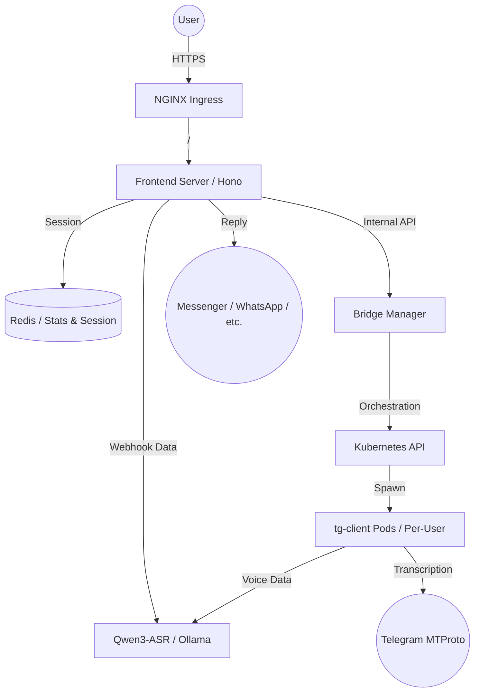

# 🎙️ Voice Messenger

> **The ultimate multi-platform voice-to-text bridge connecting Meta (FB/Insta), WhatsApp, LINE, and Telegram to state-of-the-art ASR (Qwen3-ASR).**

[]()
[]()
[-orange?style=for-the-badge&logo=openai)]()

---

## 🚀 Overview

Voice Messenger is a robust, multi-tenant system designed to transcribe voice messages across all major messaging platforms. It features a unique **per-user client architecture** for Telegram, ensuring persistent, low-latency monitoring of personal chats while providing a centralized dashboard for management.

### 🌟 Supported Platforms
- **Meta**: 🟦 Facebook Messenger & 🟪 Instagram
- **WhatsApp**: 🟩 WhatsApp Cloud API
- **Telegram**: 🛩️ Personal Accounts (MTProto) & Bot API
- **LINE**: 🟢 Messaging API
- **Threads**: 🪡 Meta Threads

---

## 🏗️ Architecture



### 🧱 Core Components

1.  **Frontend Server** (`src/`):
    *   Hono-based Node.js server serving as the primary entry point.
    *   Handles **Webhooks**, **User Authentication** (Google/Email), and the **Dashboard**.
    *   Proxies bridge commands and serves Preact-rendered UI.
2.  **Bridge Manager** (`mtproto-bridge/`):
    *   A specialized Kubernetes controller that manages the lifecycle of `tg-client` pods.
    *   Handles Telegram authentication flows (Phone/QR) and pod orchestration.
3.  **tg-client** (`tg-client/`):
    *   Persistent MTProto clients spawned **on-demand** for each Telegram user.
    *   Listen for voice messages in real-time and process them via the AI pipeline.
4.  **AI Engine** (`qwen3-asr`):
    *   Self-hosted Ollama instance running the **Qwen3-ASR** model for high-accuracy speech recognition.

---

## 🛠️ Technology Stack

| Layer | Technologies |
| :--- | :--- |
| **Backend** | TypeScript, Node.js, Hono, Express |
| **Frontend** | Preact, SSR, Vanilla CSS (Premium Aesthetics) |
| **Database** | Redis (State & Stats) |
| **AI/ASR** | Ollama, Qwen3-ASR |
| **Infrastructure** | Kubernetes (Kustomize), Docker |
| **Monitoring** | Prometheus, Grafana, Fluentd |
| **Ingress** | NGINX |

---

## 🚦 Getting Started

### Prerequisites
*   A Kubernetes cluster with `kubectl` configured.
*   `kube-dc` CLI for cluster access.
*   Redis instance reachable within the cluster.

### Deployment
The project uses a streamlined deployment script that builds the image, pushes it to Docker Hub, and updates the Kubernetes manifests.

```bash
# Deploy to the production namespace
npm run deploy:k8s
```

### Local Development
1.  **Install dependencies**:
    ```bash
    npm install
    cd mtproto-bridge && npm install
    cd ../tg-client && npm install
    ```
2.  **Run Frontend**:
    ```bash
    npm run dev
    ```
3.  **Run Bridge Manager**:
    ```bash
    cd mtproto-bridge && npm run dev
    ```

---

## 🔌 System Endpoints

| Service | Endpoint | Role |
| :--- | :--- | :--- |
| **Frontend** | `https://voicemsg.net` | Main Dashboard & Landing |
| **Bridge API** | `https://bridge.voicemsg.net` | Internal/External Bridge Logic |
| **AI API** | `https://asr.voicemsg.net` | Ollama/Qwen3-ASR Access |
| **Monitoring** | `https://grafana.voicemsg.net` | System Health & Stats |

---

## 📂 Project Structure

```text
.
├── src/                    # Frontend & Webhook logic
│   ├── components/         # Preact UI components
│   ├── controllers/        # Business logic
│   ├── routes/             # API & Webhook routing
│   └── index.ts            # Entry point
├── mtproto-bridge/         # Bridge Manager (K8s Orchestrator)
├── tg-client/              # Per-user Telegram engine
├── kubernetes/             # Infrastructure definitions
│   ├── base/               # Kustomize base resources
│   └── overlays/           # Environment-specific configs
└── scripts/                # Deployment & utility scripts
```

---

## 🛡️ Security & Privacy
*   **Dual-Factor Verification**: Requests between Frontend and Bridge are signed with a shared `BRIDGE_SECRET`.
*   **HMAC Session Signing**: All user sessions are cryptographically signed to prevent spoofing.
*   **Network Isolation**: User-specific `tg-client` pods are isolated within the cluster.

---

*Built with ❤️ for advanced agentic coding by the Voice Messenger Team.*
